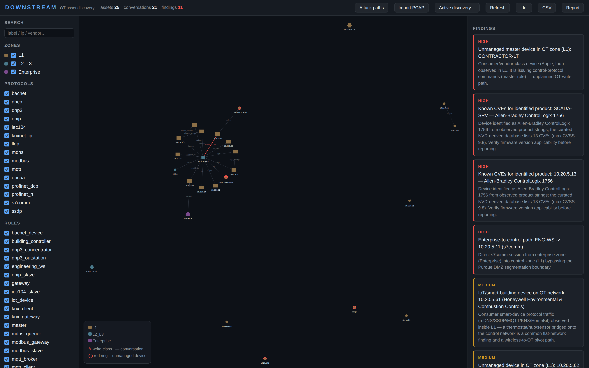

# ZerOT

Passive-first OT/ICS asset discovery with BloodHound-style graphing. Maps
control networks layer by layer — including PLCs hidden behind Modbus/TCP
gateways, DNP3 data concentrators, and routed subnets — from packet captures or
live sniffing, with a strictly gated, read-only active layer.

Single-file Python backend + single-file d3 UI. No build step. Fully
air-gap capable (d3 vendored, OUI database bundled, zero external calls).



*The demo plant from `tests/fixtures/ot_plant.pcap`: 25 assets across Purdue
zones, with virtual child PLCs behind the Modbus gateway and DNP3
concentrator. [Attack-paths view](docs/screenshot_paths.png) highlights
enterprise→PLC traversal.*

## What it detects

| Layer | Source | Output |
|---|---|---|
| Devices | Ethernet/ARP/DHCP/LLDP/**CDP**/NBNS/PN-DCP/**IPv6 NDP** | assets with MAC↔IP, vendor (IEEE OUI), hostnames |
| Conversations | Modbus, S7comm, EtherNet/IP, DNP3, IEC 60870-5-104, OPC UA, BACnet, PROFINET RT, MQTT, **GOOSE**, **Sampled Values (61850-9-2)** | directed master→slave / client→broker edges, write counts, exception counts |
| Products | CIP Identity (listIdentity), PN-DCP, DHCP | product names ("1756-L83E"), station names |
| **Identity enrichment** | **SNMP v1/v2c** (passive: community strings, sysDescr/sysName/sysLocation/sysContact) | switch/RTU/gateway identity; default communities are themselves a finding-grade fact |
| **Encrypted links** | **TLS ClientHello SNI** (any TCP port) | HTTPS HMI / TLS-MQTT hostnames — metadata only, no decryption |
| **Segmentation** | **802.1Q VLAN tags** (SPAN/mirror captures) | LLDP/PROFINET/CDP still parsed through the tag; VLAN id stored per asset |
| **Smart building / IoT** | mDNS (HomeKit/ESPHome-style PTR/SRV/TXT/A), SSDP (UPnP M-SEARCH/NOTIFY), MQTT (client-ids, topics), KNXnet/IP (search, gateway names), BACnet | thermostats, hubs, sensors as `iot_device` assets with model/platform attrs; `IoT device on OT network` findings |
| **Hidden layers** | Modbus unit IDs (>1 unit = gateway; each unit = child PLC) | virtual child assets + bridge edges |
| **Hidden layers** | DNP3 link addresses (>1 dst = data concentrator; each link = child RTU) | virtual child assets + bridge edges |
| **Hidden layers** | IP TTL (initial-guess 64/128/255) | `inferred_hops`, `last_hop_router` on routed assets |
| Purdue zones | scope file CIDRs | zone + Purdue level per asset |
| Risk | consumer-vendor device in OT zone, rogue OT master, enterprise→control session, write activity | findings (high/medium/info) |
| Attack paths | BFS from enterprise masters to PLC/RTUs across all edges incl. bridges | multi-hop enterprise→PLC paths |
| **Drift** | `last_seen` per asset | `zerot stale --days N` lists assets silent for N days |
| **Drift alerting** | `zerot watch` (diff vs baseline) | new findings/assets on new captures; cron-able exit codes (0 quiet / 1 new asset / 2 new finding) |
| **Timeline** | asset/conversation/finding timestamps | `/api/timeline` + UI Timeline panel |

## Install

Run from a checkout (air-gap friendly — no CDN/network deps at runtime):

```
uv venv && source .venv/bin/activate   # or any Python 3.10+
pip install scapy flask
sudo apt install graphviz              # optional, for svg/png export
```

Or install as a package (adds the `zerot` console command):

```
pip install .
```

## Quick start (synthetic demo plant)

```
# regenerate the 54-packet known-answer fixture
python3 scripts/gen_ot_pcap.py

# passive ingest with Purdue zoning
python3 zerot.py ingest tests/fixtures/ot_plant.pcap --scope data/scope.example.json

# explore
python3 zerot.py serve --scope data/scope.example.json
# -> http://127.0.0.1:8756  (graph, filters, findings, Attack paths button)

# exports for the report
python3 zerot.py export --format md    # findings + assets + paths
python3 zerot.py export --format svg -o plant.svg
python3 zerot.py export --format csv -o assets.csv
```

## Live capture

```
sudo python3 zerot.py live --iface eth1 --scope scope.json
sudo python3 zerot.py live --iface eth1 --scope scope.json --duration 3600 --snapshot 60
```

Live mode folds fresh packets through the exact same two-pass pipeline as pcap
ingest every `--snapshot` seconds (default 30), persisting state each time —
so router-guard ordering and gateway-child materialization behave identically
whether you ingest a file or sniff an interface. State accumulates across runs.

## Importing nmap scans

Fuse existing nmap XML exports into the same model — imported facts are
source-tagged (`nmap:<file>`) and enrich passively-observed assets (hostname,
OS guess, product/version, open ports) or add nmap-only assets:

```
nmap -sV -O 10.20.5.0/24 -oX plant.xml
python3 zerot.py ingest plant.pcap --scope scope.json --db state.json
python3 zerot.py import-nmap plant.xml --scope scope.json --db state.json
```

## Product → CVE enrichment (offline)

Identified products (ENIP list-identity strings, S7 SZL module names, nmap
product/OS) are matched against a curated OT CVE database
(`data/ot_cves.json`, 500+ CVEs across 19 product families) built from live
NVD 2.0 API queries by `scripts/build_cve_db.py` with a vendor-relevance
filter — nothing is hand-typed. Runtime lookup is pure offline; findings cite
the db generation date and remind you to verify version applicability.
Refresh the db with `python3 scripts/build_cve_db.py` (needs network, ~3 min).

## Evidence provenance

Every asset, conversation, and finding carries citation records — source pcap
file, frame number, timestamp — so any claim in the report can be replayed in
Wireshark (`frame.number == N`). Evidence is capped per object (first + latest)
and round-trips through save/load. The UI shows it in the asset detail panel.

## Diffing captures (day-over-day drift)

```
python3 zerot.py ingest day1.pcap --scope scope.json --db day1.json
python3 zerot.py ingest day2.pcap --scope scope.json --db day2.json
python3 zerot.py diff day1.json day2.json            # --json for machines
```

Reports new devices (with vendor/zone/roles), departed devices, new
conversations, and new findings — a new device showing up on an OT network is
itself a reportable observation.

## Staleness (silent assets)

```
python3 zerot.py stale --db state.json --days 7
```

Lists assets whose last on-the-wire activity is older than the threshold —
candidates for decommissioned gear, dead sensors, or inventory drift. Frame it
as an observation: silent ≠ gone (a PLC polled once a day is silent 23h).

## Watch mode (cron-able drift alerting)

```
# nightly: fold the day's capture in, alert on anything NEW
python3 zerot.py watch today.pcap --scope scope.json --db state.json --min-sev medium
```

Diffs the post-ingest state against the pre-ingest baseline (kept at
`state.baseline.json`): new findings at/above `--min-sev` and new assets are
printed (`--json` for machines). Exit codes suit cron/systemd: `0` quiet,
`1` new device on the network, `2` new finding — a new master appearing on an
OT segment pages you, routine rediscovery doesn't.

## IEC 61850 (GOOSE / Sampled Values)

Layer-2, IP-less: GOOSE (0x88B8) publishers are identified by MAC + gocbRef
(IEED name) + datSet (what it publishes) + stNum; SV (0x88BA) merging units
by MAC + noASDU. Works through VLAN tags. These are the protection-grade
protocols — tripping signals and CT/VT streams — so their presence alone
usually marks a safety-relevant segment: treat as observe-only.

## Layer crawling

```
python3 zerot.py crawl --scope scope.json            # dry-run: shows next targets
sudo python3 zerot.py crawl --scope scope.json --execute --yes
```

Crawl analysis is driven by what the graph already knows:
1. routed subnets (TTL-observed `last_hop_router`) → probe the unseen /24,
2. gateway/concentrator assets → enumerate unit IDs / link addresses,
3. out-of-scope IPs seen in conversations → surface for ROE review before probing.

Each round only uses the gated read-only techniques (`arp_ping`, `tcp_probe`,
`modbus_id`, `enip_list`); the next round's targets are recomputed from what
the previous round learned. It stops when no new targets appear.

## Scope file (ROE boundary)

```json
{
  "name": "Plant A",
  "zones": {"L1": ["10.20.5.0/24"], "L2_L3": ["10.20.7.0/24"], "Enterprise": ["10.20.9.0/24"]},
  "excluded": ["10.99.0.0/16"],
  "active": {
    "enabled": true,
    "techniques": {"arp_ping": "allow", "tcp_probe": "confirm",
                    "modbus_id": "confirm", "enip_list": "allow"}
  }
}
```

- `allow`   — in-scope, low-risk; runs with `--execute`
- `confirm` — needs `--yes` as explicit acknowledgement
- `block`   — never runs (also: active disabled ⇒ everything blocked)

**Write-class probes do not exist in this tool.** The technique registry is a
closed set of read-only discovery methods (`arp_ping`, `tcp_probe`, `modbus_id`,
`enip_list`, `mdns_query`, `ssdp_msearch`,
`modbus_unit_sweep`, `bacnet_whois`, `s7_szl`, `snmp_sysdesc`); unknown technique names are hard
blocked at execution time.

## API (serve mode)

| Method | Path | Purpose |
|---|---|---|
| GET | /api/graph | nodes/links/findings |
| GET | /api/paths | enterprise→PLC multi-hop paths |
| GET | /api/timeline | chronological asset/conversation/finding feed |
| GET | /api/events | ingest/active event log |
| POST | /api/pcap | `{"paths": [...]}` server-side pcap ingest |
| POST | /api/active/plan | plan with allow/confirm/block counts |
| POST | /api/active/run | `{"execute": bool, "yes": bool}` |
| GET | /api/export/{dot,svg,png,csv,edges.csv,md,json} | exports |

## Testing

```
python3 -m pytest tests/ -q
```

62 tests over the synthetic known-answer fixture: vendors, roles, edges,
gateway/concentrator virtual children, router-guard (scope-derived boundaries
+ /23 merge), TTL hop inference, attack paths, smart-building/IoT devices
(mDNS/SSDP/MQTT/KNX), IoT-on-OT findings, CDP/VLAN-through-tag/SNMP
community+system-group/TLS SNI/NDP identity, banner grab, staleness CLI,
GOOSE/SV 61850 dissectors, snmp_sysdesc probe, watch drift alerting,
timeline shape, active gating (dry-run, unknown-technique block,
confirm-requires-yes), exports, save/load roundtrip, CLI smoke.

## Safety posture

- Passive ingest is read-only by construction.
- Active layer is dry-run by default; gated per technique; capped (`max_tasks`,
  inter-probe interval); read-only techniques only.
- Routed-traffic identity: a MAC claiming IPs across /24s is treated as a
  last-hop router, never merged into the remote host's identity (and
  LLDP-learned routers are never overwritten).
- All findings are labeled as observed-conversation inferences; the report
  carries an explicit non-claims section.

## Limitations

- CIP identity parsing covers listIdentity responses (fixed layout).
- S7 write detection covers Job requests with function group 0x12/0x01 (write
  var); not all S7 write encodings.
- TTL hop inference assumes initial TTL of 64/128/255.
- Virtual children represent protocol-level identities; they are not separate
  IP assets and cannot be probed directly — probe the gateway instead.
